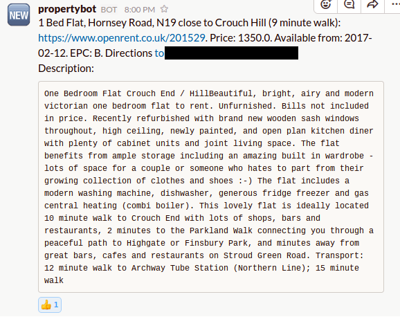

# Openrent slack notifier

This program parses property listings on openrent.co.uk and if a listing is new
and is suitable then it will issue a slack notification.

Be the first one to contact the landlord!

# How it works

`./get_properties.py` gets the list of candidate properties than parses each and
notifies if the property is promising.

Links to parsed properties are stored in `links.json` whilst data about each property
is stored in text files in `properties/` folder.

For example:

```
> cat properties/201736
{
    "id": "201736",
    "title": "1 Bed Flat, Narcissus Road, NW6",
    "location": [
        [
            "West Hampstead",
            "6 minute walk"
        ],
        [
            "Finsbury Park",
            "6 minute walk"
        ],
        [
            "Finchley Road & Frognal",
            "6 minute walk"
        ],
        [
            "West Hampstead Station",
            "7 minute walk"
        ]
    ],
    "price": 1500.0,
    "description": "Stunning refurbished 1 bedroom flat on Narcissus Rd, wood flooring throughout, high ceilings, period features, very central location 5 walk from West Hampstead station.  Fully furnished.  Period building in excellent condition Huge windows, light & bright. Large lounge, separate open plan modern fully fitted kitchen, modern bathroom, lovely bedroomInterior designed flat- colour scheme can be changed to all white if preferred by next tenants!This is a great, central, modern c (400 sq ft) beautifully presented flat.  First time available in nearly 4 years and went on 1st viewing last time available.  Long letMOVE DATE FLEXIBLE end Feb/early March",
    "available_from": "2017-02-24",
    "EPC": "B",
    "has_garden": false
}

> head -n10 links.json

[
    "192135",
    "155303",
    "185305",
    "196322",
    "177777",
    "153587",
    "181113",
    "188911",
    "188648",
```

# Installation

`pip3 install -r requirements.txt`

Then add the folling to your crontab:

```
*/10 * * * * /usr/bin/python3 $HOME/openrent/get_properties.py
```

# Usage

Create `config.json` as per example:

```
{
	"work_addr1": "------",
	"work_addr2": "-------",
	"slack_token": "xoxp-*****"
}
```

modify `should_notify` in `./get_properties.py` as appropriate.

Also you probably want to modify `query_string` too:

```
    query_string = urlencode(
        OrderedDict(term=work_addr1,
                    within="10",
                    prices_min=1100,
                    prices_max=1500,
                    bedrooms_min=1,
                    bedrooms_max=2,
                    isLive="true"))
```

# Example of a notification


